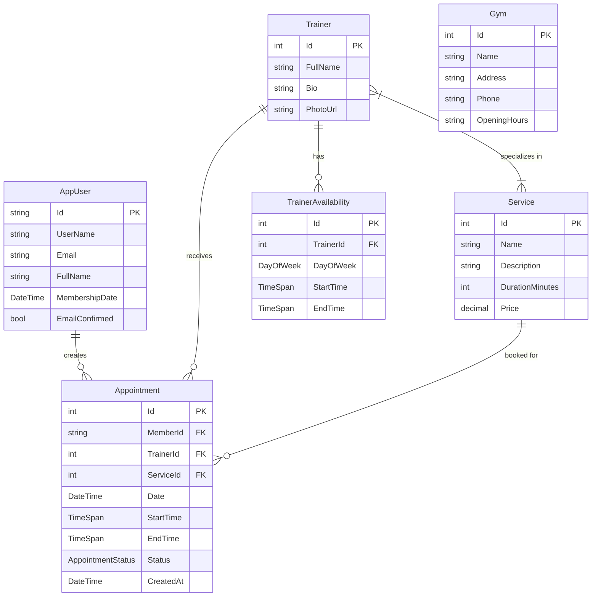

# Spor Salonu Yönetim Sistemi - Veritabanı Şeması

## Entity Relationship Diyagramı (ER Diagram)



## SQL Server Tablo Şeması

### AspNetUsers (Identity - AppUser)
```sql
CREATE TABLE [AspNetUsers] (
    [Id] NVARCHAR(450) NOT NULL PRIMARY KEY,
    [UserName] NVARCHAR(256) NULL,
    [NormalizedUserName] NVARCHAR(256) NULL,
    [Email] NVARCHAR(256) NULL,
    [NormalizedEmail] NVARCHAR(256) NULL,
    [EmailConfirmed] BIT NOT NULL,
    [PasswordHash] NVARCHAR(MAX) NULL,
    [FullName] NVARCHAR(MAX) NOT NULL,
    [MembershipDate] DATETIME2 NOT NULL,
    -- Diğer Identity alanları...
);
```

### Trainers
```sql
CREATE TABLE [Trainers] (
    [Id] INT IDENTITY(1,1) NOT NULL PRIMARY KEY,
    [FullName] NVARCHAR(MAX) NOT NULL,
    [Bio] NVARCHAR(MAX) NULL,
    [PhotoUrl] NVARCHAR(MAX) NULL
);
```

### Services
```sql
CREATE TABLE [Services] (
    [Id] INT IDENTITY(1,1) NOT NULL PRIMARY KEY,
    [Name] NVARCHAR(MAX) NOT NULL,
    [Description] NVARCHAR(MAX) NOT NULL,
    [DurationMinutes] INT NOT NULL,
    [Price] DECIMAL(18,2) NOT NULL
);
```

### ServiceTrainer (Çoka-Çok İlişki Tablosu)
```sql
CREATE TABLE [ServiceTrainer] (
    [SpecialtiesId] INT NOT NULL,
    [TrainerId] INT NOT NULL,
    PRIMARY KEY ([SpecialtiesId], [TrainerId]),
    FOREIGN KEY ([SpecialtiesId]) REFERENCES [Services]([Id]),
    FOREIGN KEY ([TrainerId]) REFERENCES [Trainers]([Id])
);
```

### TrainerAvailabilities
```sql
CREATE TABLE [TrainerAvailabilities] (
    [Id] INT IDENTITY(1,1) NOT NULL PRIMARY KEY,
    [TrainerId] INT NOT NULL,
    [DayOfWeek] INT NOT NULL,
    [StartTime] TIME NOT NULL,
    [EndTime] TIME NOT NULL,
    FOREIGN KEY ([TrainerId]) REFERENCES [Trainers]([Id])
);
```

### Appointments
```sql
CREATE TABLE [Appointments] (
    [Id] INT IDENTITY(1,1) NOT NULL PRIMARY KEY,
    [MemberId] NVARCHAR(450) NOT NULL,
    [TrainerId] INT NOT NULL,
    [ServiceId] INT NOT NULL,
    [Date] DATETIME2 NOT NULL,
    [StartTime] TIME NOT NULL,
    [EndTime] TIME NOT NULL,
    [Status] INT NOT NULL DEFAULT 0,
    [CreatedAt] DATETIME2 NOT NULL,
    FOREIGN KEY ([MemberId]) REFERENCES [AspNetUsers]([Id]),
    FOREIGN KEY ([TrainerId]) REFERENCES [Trainers]([Id]),
    FOREIGN KEY ([ServiceId]) REFERENCES [Services]([Id])
);
```

### Gyms
```sql
CREATE TABLE [Gyms] (
    [Id] INT IDENTITY(1,1) NOT NULL PRIMARY KEY,
    [Name] NVARCHAR(MAX) NOT NULL,
    [Address] NVARCHAR(MAX) NOT NULL,
    [Phone] NVARCHAR(MAX) NOT NULL,
    [OpeningHours] NVARCHAR(MAX) NOT NULL
);
```

## AppointmentStatus Enum Değerleri

| Değer | Enum | Açıklama |
|-------|------|----------|
| 0 | Pending | Onay Bekliyor |
| 1 | Approved | Onaylandı |
| 2 | Rejected | Reddedildi |
| 3 | Completed | Tamamlandı |
| 4 | Cancelled | İptal Edildi |

## İlişki Özeti

| İlişki | Tür | Açıklama |
|--------|-----|----------|
| AppUser → Appointment | 1:N | Bir üye birden fazla randevu alabilir |
| Trainer → Appointment | 1:N | Bir antrenör birden fazla randevu alabilir |
| Service → Appointment | 1:N | Bir hizmet birden fazla randevuda kullanılabilir |
| Trainer → TrainerAvailability | 1:N | Bir antrenörün birden fazla müsaitlik zamanı olabilir |
| Trainer ↔ Service | N:N | Antrenörler birden fazla hizmette uzmanlaşabilir |
